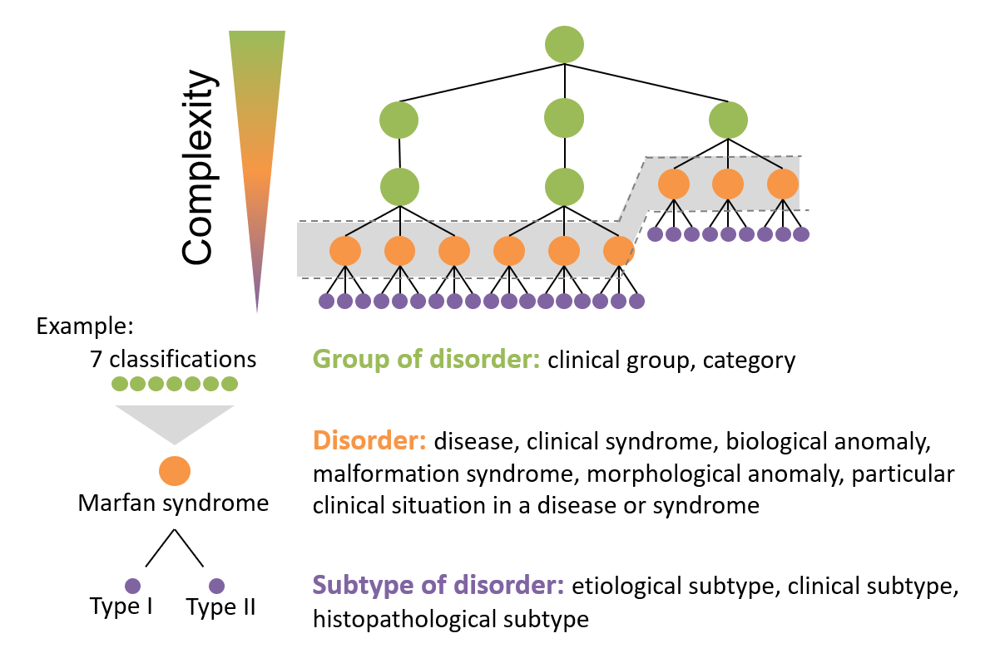
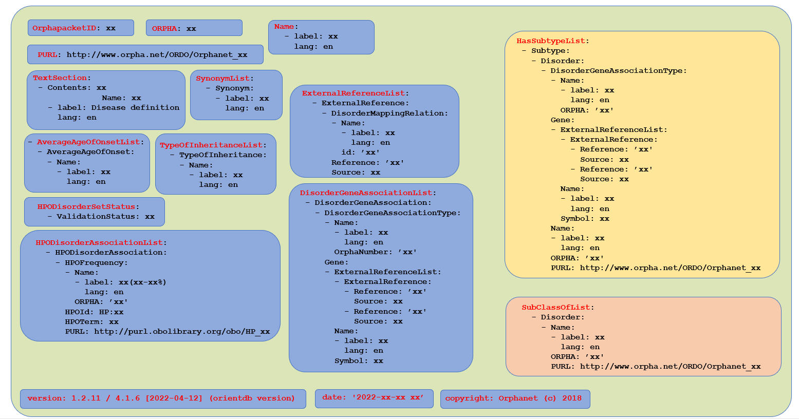

# Orphanet ORPHApackets

An ORPHApacket is a formalized data sharing container embedding “pieces” of knowledge related to known rare disorders derived from the Orphanet knowledge database and ORDO (Orphanet Rare Diseases Ontology). The ORPHApacket format is encoded in JSON or YAML.

An ORPHApacket includes among other (see Figure 2):

* ORPHApacket ID (an ORPHAcode for an already known concept in the Orphanet database or a specific ID with “RD_” prefix if it is a not yet known concept in ORDO)
* Label with the language of the label (English by default)
* An ORPHAcode (if an already known concept), and its PURL (Persistent URL) to the concept in ORDO
* Version and the date of Orphanet Database extraction used to produce the ORPHApacket.
* Type which differs depending on the level of granularity of each clinical concept defined as follows (see Figure 1 below): 
   - **Group of disorder** is defined as a “clinical entity defined by a set of phenotypic abnormalities shared by several diseases, malformation or clinical syndromes, morphological or biological anomalies, and particular clinical situations in a disease or a syndrome and used to group them together.”
   - **Disorder** is a “clinical entity defined by the comprehensive set of phenotypic abnormalities characterizing it. It can be a disease, a malformation or clinical syndrome, a morphological or biological anomaly or a particular clinical situation in a disease or a syndrome”.
   - **Subtype of disorder** is a “subdivision of a disease, malformation syndrome, morphological anomaly, biological anomaly, clinical syndrome or particular clinical situation in a disease or a syndrome further defined by its particular clinical presentation.” It can be a clinical subtype, an etiological subtype or a histopathological subtype.

Figure 1

Depending on the available data, especially the level of granularity of each concept, an ORPHApacket can also contain:
* Concept definition
* List of synonyms
* Average age of onset of the disorder
* Mode of inheritance
* Epidemiological annotations
* ”Subclass of” list with reference to “upper” concepts in ORDO, with label of those upper concepts, ORPHA number and PURL.
* “HasSubtype” list with reference to “child” concept in ORDO, with label of those concepts, ORPHAnumber, PURL,
* Gene-Disorder association including the HGNC gene label and symbol, external reference to OMIM and HGNC
* HPO-disorder association together with its related list of HPO Id, HPO English label with their frequency of occurrence for the specific disease concept (including negative relationship (i.e. HPO term always absent for a given disease), PURL of the HPO concept.

Here is schematized the contain of an ORPHApacket:

Figure 2

As explained before, depending of the type of concept (group of disorder, disorder or subtype of disorder), an ORPHApacket will contain more or less information. Less in the case of an ORPHApacket dedicated to a “group of disorder” concept, more for an ORPHApacket related to a “disorder” concept or a “subtype” concept, for instance including gene data. ORPHApackets could be enriched afterwards with any relevant piece of information, therefore making its content evolving in time to fit the needs of the project. ORPHApacket releases are produced twice a year,synchronized with the ORDO generation and are freely available in a dedicated GitHub repository (https://github.com/Orphanet/orphapacket)

## References

1.	ORDO (Orphanet Rare Disease Ontology) (https://www.orphadata.com/ordo/)
2.	The Human Phenotype Ontology (https://hpo.jax.org/app/)

## Authors
Contributors names and contact info:
* David Lagorce [@david.lagorce@inserm.fr]
* Marc Hanauer [@marc.hanauer@inserm.fr]

